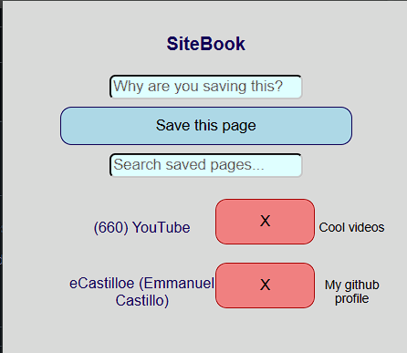
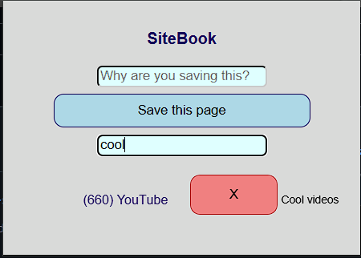

# SiteBook - Chrome Extension

A quick-capture tool for saving pages with context, not just links. Unlike Google bookmarks, every saved page includes a short note on why you saved it, and both title and note are searchable.

##Features
- Save the current tab's title and URL with one click
- Attach a short note explaining why you saved it
- Live search across saved titles and notes
- Delete saved pages
- Persist across browser sessions via chrome.storage.local

##Tech
Vanilla JavaScript, Chrome Extension Manifext V3, chrome.storage API

##Install (development mode)
1. Clone this repo
2. Go to chrome://extensions
3. Enable Developer mode
4. Click "Load unpacked" and select this folder

